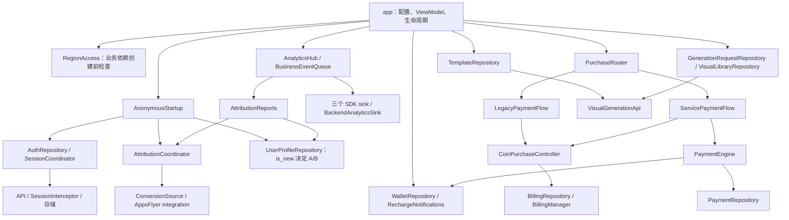

# Core 功能与公共接口清单

源码基线：`950f524`，更新：2026-09-18。分析范围：`core/src/main/java/com/vexora/core` 下 11 个包、57 个 Kotlin 生产源码文件；第 3.4 节另列 AppsFlyer integration 与宿主接入边界，不计入 Core 文件数。本文描述现有实现，不把源码存在视为真实平台收数验收。

后续跨项目结构调整、Model新增字段与dev/prod材料交付见 交付规格（历史参考，契约以本文正文和随包源码为准） 和 计划（历史参考，契约以本文正文和随包源码为准）。交付包已获授权制作，当前Vexora源码仍未改造；本清单的签名/协议仍描述现有实现，不提前列入未来冗余字段。

## 1. 阅读约定与功能总览

- **业务入口**：供宿主 ViewModel、应用协调器或生命周期桥接调用，页面仍应通过 ViewModel 使用。
- **底层接口**：API、存储、SDK 适配和注入扩展点，不能绕过业务入口直接作为完整流程使用。
- **框架入口**：Hilt Provider、OkHttp/Billing 回调，虽为 public，但通常由框架调用。
- Kotlin 未标注可见性的声明默认为 public。`internal` 单列，不算 app 可调用的公共接口；private 方法、局部函数、匿名监听器的方法不逐项列出。
- 方法表保留参数类型、默认值、返回类型和 `suspend`；省略 Retrofit/Hilt 注解及冗长包名前缀。实现与接口方法相同时合并列出，默认参数以接口声明为准。
- 数据模型列出职责、主要属性与自定义方法；不重复列构造器以及自动生成的 `copy/componentN/equals/hashCode`、序列化方法。自定义 `toString` 统一在第 12 节说明。
- `Unit` 仅表示没有业务返回值，不表示远端交易已完成。`StateFlow` 表示持续状态；`SharedFlow/Flow` 事件应按所属账号处理。

| 包 | 提供的具体功能 | 主要入口类/接口 |
| --- | --- | --- |
| config | 环境、网络、存储、日志、账号规则的类型化配置 | CoreRuntimeConfig、AppConfiguration、ClientIdentity |
| analytics | 统一四端业务事件契约、参数标准化、自有后端上报 | EventTracker、AnalyticsSink、BackendAnalyticsSink、EventApi |
| attribution | 登录前归因等待/重试、缓存与独立补报 | AttributionCoordinator、ConversionSource、AttributionReports |
| auth | 正式匿名启动、profile 决策、会话刷新；保留旧认证底层能力 | AnonymousStartup、UserProfileRepository、AuthRepository、SessionCoordinator |
| network | API 封装、公共/受保护/支付客户端、认证拦截与日志 | PublicAuthApi、AccountApi、SessionInterceptor、NetworkModule |
| catalog | 首页/视频/图片模板、分类、媒体与报价、预览 fixture | TemplateRepository、ApiTemplateRepository |
| visual | 私有选图准备、持久幂等生成、任务查询、作品分页 | PrivateGenerationStorage、GenerationRequestRepository、VisualLibraryRepository |
| wallet | 金币商品、余额、流水、业务建单、充值 WebSocket 通知 | WalletRepository、RechargeNotifications |
| billing | Play 商品查询、购买回调关联、pending 恢复、消费去重 | BillingRepository、CoinPurchaseController、BillingManager |
| payment | LEGACY/SERVICE 路由、第三方初始化、持久查单与事件队列 | PurchaseRouter、PaymentEngine、PaymentCoordinator |
| region | 前置地区检查、独立出口 IP 查询、联网判断与诊断码 | RegionAccess、CountryIsRegionSource |

主要协作关系如下。箭头表示主要调用或实现关系，不是完整 Gradle 依赖图：



## 2. config：配置与账号校验

源码：[AppConfiguration.kt](../reference/core/src/main/java/com/vexora/core/config/AppConfiguration.kt)、[ClientIdentity.kt](../reference/core/src/main/java/com/vexora/core/config/ClientIdentity.kt)、[CoreRuntimeConfig.kt](../reference/core/src/main/java/com/vexora/core/config/CoreRuntimeConfig.kt)。

| 类/枚举 | 主要公共属性 | 功能与边界 |
| --- | --- | --- |
| AppMode | A、B | 业务展示模式，不是 Gradle flavor |
| AccountRules | usernameMin/usernameMax/passwordMin/passwordMax: Int | 构造时校验长度区间 |
| AppConfiguration | accountRules；privacyUrl/termsUrl/aboutUrl/contactUrl: String | 账号规则与设置链接，不负责打开网页 |
| ClientIdentity | packageName/versionName: String；timeoutSeconds: Long | 请求身份与超时，由 app 提供 |
| CoreRuntimeConfig | network: NetworkConfig；storage: StorageConfig；diagnostics: DiagnosticsConfig | Core 运行时配置入口 |
| NetworkConfig | baseUrl/streamUrl/cdnUrl: String | 校验 scheme/host、禁止首尾空格与 URL 用户信息/query/fragment；baseUrl 必须以 `/` 结尾 |
| StorageConfig | databaseName/preferencesName: String | 校验非空；databaseName 当前只是配置，未实现数据库 |
| DiagnosticsConfig | enableDebugLogging: Boolean；redactHttpLogs: Boolean = true | 日志启用/脱敏策略；Debug 与环境开关的合并在 app |

唯一自定义公共方法：`AccountRules.accepts(account: String, password: String): Boolean`，判断 trim 后的账号长度和未经 trim 的密码长度是否落在配置区间。其余配置仅通过构造器和属性提供值，没有 setter 或业务操作。

## 3. analytics / attribution：业务埋点、归因与 SDK 适配

### 3.1 统计契约、参数与自有接口

源码：[AnalyticsSink.kt](../reference/core/src/main/java/com/vexora/core/analytics/AnalyticsSink.kt)、[EventTracker.kt](../reference/core/src/main/java/com/vexora/core/analytics/EventTracker.kt)、[EventApi.kt](../reference/core/src/main/java/com/vexora/core/analytics/EventApi.kt)、[BackendAnalyticsSink.kt](../reference/core/src/main/java/com/vexora/core/analytics/BackendAnalyticsSink.kt)。

| 类/接口 | 公共方法 | 作用 |
| --- | --- | --- |
| AnalyticsSink | `initialize(): Unit`、`identify(userId: String?): Unit`、`event(name: String, parameters: Map<String, Any> = emptyMap()): Unit` | 初始化、用户绑定和原始事件发送契约 |
| AttributionIdProvider | `currentId(): String` | 为网络头提供 AF UID |
| EventTracker / NoOpEventTracker | `track(name: String, parameters: Map<String, Any> = emptyMap(), userId: String? = null, onceKey: String? = null): Unit` | 业务唯一事件入口；NoOp 实现直接忽略，正式由 app 绑定 BusinessEventQueue |
| AnalyticsPlatform | `eventName(name: String): String` | 为无前缀事件添加 FIREBASE=f、APPS_FLYER=a、THINKING_DATA=s、BACKEND=z 前缀；prefix 为公开属性 |
| BackendAnalyticsSink | 实现 AnalyticsSink 的三个方法 | 有界内存 Channel；initialize 幂等启动消费者；identify 更新入队身份；event 冻结身份/时间/参数并非阻塞入队 |
| EventApi | `suspend reportEvent(request: ReportEventRequest): Response<ApiResponse<Unit>>` | 公共客户端 POST `events/report`，相对当前 flavor 业务 API，支持登录前匿名事件 |

`AnalyticsPolicy(firebase, appsFlyer, thinkingData, backend: Boolean)` 包含四端开关。`AnalyticsConfiguration(storageName: String, backgroundTimeoutMs: Long, queueCapacity: Int, dedupeLimit: Int)` 校验非空/正数；应用注入默认后台会话超时 30000ms、队列容量256、去重上限10000，`ENABLE_BACKEND_ANALYTICS=true`。

`ReportEventRequest` 字段：deviceId/eventType/eventTime/userId?/packageName/appVersion/platform/parameters，JSON 映射为 device_id/event_type/event_time/user_id/package_name/app_version/platform/parameters，parameters 类型为 `Map<String, String>`。eventTime 是毫秒；platform=android，eventType 如 z_app_launch。接口成功要求 HTTP 成功且响应 code=0，不要求 Unit data 非空。publicClient 仍带通用客户端身份头，但不带受保护客户端的 Bearer；事件正文 userId 在入队时冻结，不能声称整个请求的所有头也都冻结。

顶层公共函数/扩展：

| 签名 | 行为 |
| --- | --- |
| `Template.analyticsProperties(): Map<String, Any>` | template_id/category_id/modality |
| `analyticsParameters(values: Map<String, Any>): Map<String, Any>` | 键匹配 `[a-zA-Z][a-zA-Z0-9_]{0,39}`；布尔转1L/0L、整数转Long、浮点转有限Double、字符串截100字符；只保留前25个合法标量 |
| `paymentPriceProperties(price: Double?, currency: String?, source: String): Map<String, Any>` | 合法非负价格→af_price/price_source；三字母币种→af_currency |
| `paymentProperties(status: String, method: String, flow: String, source: String, productId: String, orderId: String? = null, stage: String, reason: String? = null, amount: Double? = null, currency: String? = null): Map<String, Any>` | 构造状态、渠道、流程、来源、package_id、af_order_id、阶段/原因及价格字段 |
| `EventTracker.paymentResult(values: Map<String, Any>, userId: String, onceKey: String? = null): Unit` | 分别发 pay_result 与 payment_custom；去重键加 :result/:custom，仅符合条件的 payment_custom 添加 af_revenue |

收入条件：status=success、pay_method=google_play、price_source=google_play、有限非负 af_price、有效 af_currency。当前价格来源是 Play ProductDetails 的微单位价；普通 pay_result、兼容 purchase_client 系列不带收入；SERVICE 第三方只持有 catalog_quote，不推算收入；恢复历史购买缺价格也不补造收入。`af_success` 字符串 false 不代表业务必定失败，应同时读取 status 的 cancelled/pending/unknown/closed 等分类。支付状态/真实钱包确认不因埋点改变。

BackendAnalyticsSink 不持久化、不在应用层重试；队列满丢弃新事件，单次失败不终止消费者，不承诺必达。底层公共 HTTP 客户端行为不能等同“请求严格仅发送一次”。参数标准化只检查格式/标量，**不会按语义自动删除凭据或 URL**，业务调用方必须遵守参数白名单。AnalyticsPlatform.eventName 直接拼接前缀，没有识别/去除已有前缀的逻辑，因此调用方必须传无前缀名。

### 3.2 归因等待、缓存与独立补报

源码：[AttributionCoordinator.kt](../reference/core/src/main/java/com/vexora/core/attribution/AttributionCoordinator.kt)、[AttributionModels.kt](../reference/core/src/main/java/com/vexora/core/attribution/AttributionModels.kt)、[AttributionReports.kt](../reference/core/src/main/java/com/vexora/core/attribution/AttributionReports.kt)。

| 类/接口 | 公共成员 | 功能 |
| --- | --- | --- |
| AttributionCoordinator | `snapshots: StateFlow<JsonObject?>` | 发布真实有效回调，用于缓存写入和补报；缓存读入 latest 不自动发布 snapshots |
| AttributionCoordinator | `suspend awaitInitial(): Boolean` | 一次进程内记住首次等待结果；成功返回true，失败/超时false并有限重试；不返回 AppMode |
| AttributionCoordinator / LoginAttributionProvider | `suspend forLogin(): LoginAttribution` | 等初始结果，限时等缓存读取，再以最新有效回调/缓存/空对象构造登录归因 |
| ConversionSource | `conversion: StateFlow<ConversionResult>` | Pending/Success(data: JsonObject)/Failed |
| ConversionSource | `startAttribution(): Unit`、`retryAttribution(): Unit` | 启动/重试扩展点；接口默认retry委托start，AppsFlyer实现区分首次/重试 |
| ConversionSource | `attributionUid(): String`、`advertisingId(): String?` | UID/可用广告ID |
| AttributionStorage | `suspend readAttribution(): JsonObject?`、`suspend writeAttribution(data: JsonObject): Unit` | 安装级持久缓存 |
| AttributionReportApi | `suspend report(payload: JsonObject): ApiResponse<Unit>` | 公共 POST attribution/report，不刷新/重建登录会话 |
| AttributionReports | `start(): Unit` | 幂等启动 snapshots 与会话 epoch 的联合订阅；异步补报后刷新同epoch profile |

`AttributionConfiguration(timeoutMillis: Long, retryAttempts: Int, retryIntervalMillis: Long, cacheWaitMillis: Long = 100)` 全部正数。当前宿主注入5000ms/10次/5000ms/200ms，最后一个值覆盖类默认100ms。awaitInitial 的false不因迟到回调变true，后续有效数据由 snapshots/forLogin 体现；Organic/Non-organic只判断回调是否有效，不用于选择A/B。

| 顶层公共函数 | 功能 |
| --- | --- |
| `JsonObject.hasValidAttribution(): Boolean` | af_status 为 organic/non-organic（忽略大小写）才有效 |
| `attributionPayload(data: JsonObject, identity: ClientIdentity, deviceId: String, afUid: String): LoginAttribution` | 组装登录 attribution，来源字符串为 appsflyer |
| `conversionJson(value: Any?): JsonElement` | 保留嵌套、布尔、数字、数组、null |
| `deviceAttributionReport(data: JsonObject, identity: ClientIdentity, deviceId: String, userId: String?): JsonObject` | 独立补报：顶层设备/构建/可选用户身份、归因维度、click_time/install_time 和 extra_data，来源字符串为 AppsFlyer |

`LoginAttribution` 字段为 attributionSource/deviceId/afUid/network/campaign/campaignId/adgroup/adgroupId/creative/creativeId/channel/country/platform/appVersion/packageName/extraData。登录归因 deviceId 优先可用广告ID，否则安装ID；独立补报固定用 SessionStorage.deviceId 安装ID。二者不是可互换请求体，不能改掉来源大小写或在后者凭空添加登录全部字段。

AttributionReports 对每组“有效快照＋epoch”有限重试；补报成功后即使 profile 失败，当前组后续只重试 profile。新快照或epoch会取消旧组并重新处理，可在无会话时补报；不是持久补报队列或服务端严格幂等机制。首次 profile 失败由 Splash 重试；迟到刷新失败保留最后真实模式。旧 resolveMode/attributionMode 已移除。

### 3.3 宿主四端分发与三种上报通道

[BusinessEventQueue](../reference/app/src/main/java/com/vexora/app/analytics/BusinessEventQueue.kt) 实现 EventTracker，补 event_id/event_time/session_id/app_mode，并按账号+onceKey 哈希维护有限本地去重；只有成功进入内存队列后才记录去重键。内存事件丢失而去重已保存时不保证重放，因此不是 exactly-once。

[AnalyticsHub](../reference/app/src/main/java/com/vexora/app/analytics/AnalyticsHub.kt) 在准入后初始化已启用的四端、启动 AttributionReports，合并公共字段后分发。带旧userId的迟到业务事件会被丢弃；匿名事件允许匿名投递，每次发送临时绑定事件用户后恢复当前用户，各端异常隔离。前缀由 sink 添加一次；自动SDK事件保持原名。[ForegroundAnalytics](../reference/app/src/main/java/com/vexora/app/analytics/ForegroundAnalytics.kt) 和 [PageAnalytics](../reference/app/src/main/java/com/vexora/app/analytics/PageAnalytics.kt) 负责前后台会话与页面曝光，均在 app。

| 通道 | 发起点与接口 | 交付/重试边界 |
| --- | --- | --- |
| 四端手动业务埋点 | EventTracker → app队列/Hub → BackendAnalyticsSink → events/report，以及三个SDK | 业务队列和后端队列均有界内存，后端无应用级重试；本地去重键持久，不保证事件必达 |
| 安装归因补报 | AttributionReports → attribution/report → user/profile | 当前快照/epoch内有限重试；不重新登录，不带业务事件前缀 |
| 支付服务遥测 | PaymentEventQueue → client/payments/{id}/client-events | 独立持久队列、按账号发送、有界重试；保持渠道协议；另经EventTracker报告少量业务事件 |

### 3.4 AppsFlyer 适配与 SDK 升级边界（不属于 Core 源码目录）

源码：[AppsFlyerAnalytics](../reference/integration/analytics-appsflyer/src/main/java/com/vexora/core/integration/appsflyer/AppsFlyerAnalytics.kt)、[AppsFlyerConfig](../reference/integration/analytics-appsflyer/src/main/java/com/vexora/core/integration/appsflyer/AppsFlyerConfig.kt)、[ForegroundAttributionStart](../reference/integration/analytics-appsflyer/src/main/java/com/vexora/core/integration/appsflyer/ForegroundAttributionStart.kt)、[依赖声明](../reference/integration/analytics-appsflyer/build.gradle.kts)、[版本目录](../reference/gradle/libs.versions.toml)。

当前工程从6.12.2升级为6.18.1，显式加入Install Referrer 2.2。这是源码锁定版本，不是对未来最新/受支持版本的永久承诺；发布前按 故障复盘与发布检查（历史参考，契约以本文正文和随包源码为准） 核对官方支持周期、最终依赖、实际请求和回调，不能只照搬参考工程。

| 类型 | 公共成员 | 作用 |
| --- | --- | --- |
| AppsFlyerConfig | devKey/debugLogging/enabled/diagnosticLogging | key 非空；完整日志与安全诊断分别开关 |
| AppsFlyerAnalytics | `onActivityResumed(activity: Activity): Unit`、`onActivityPaused(activity: Activity): Unit` | 准入后绑定/解绑前台宿主 |
| 同上 | `initialize()`、`startAttribution()`、`retryAttribution()`：Unit | 请求启动，后台等待有效Activity；不是立刻取得归因 |
| 同上 | `identify(userId: String?): Unit`、`event(name: String, parameters: Map<String, Any>): Unit` | 设置SDK用户、发送带a_前缀手动事件 |
| 同上 | `currentId(): String`、`attributionUid(): String`、`advertisingId(): String?` | ready前UID为空；广告ID受限/全零/无效返回null |
| 同上 | `conversion: StateFlow<ConversionResult>`、`startStatus: StateFlow<AttributionStartStatus>` | 安装归因结果与请求阶段分别观察 |
| AttributionStartStatus / AttributionStartStage | stage/errorCode；NOT_REQUESTED、WAITING_FOR_ACTIVITY、START_CALLED、REQUEST_ACCEPTED、REQUEST_FAILED、INITIALIZATION_FAILED、DISABLED | 请求被接受不代表取得有效安装归因 |

internal ForegroundAttributionStart 以弱引用保存宿主，主线程串行 attach/detach/request；初次和重试调用 `start(activity, devKey, listener)`，不回退 Application Context。SDK init 仍接应用Context，业务上报 logEvent 也用应用Context，不能误改成所有SDK方法都必须Activity。前后台切换与重复请求合并在适配层处理，Core只持有ConversionSource。

prodRelease地区门禁通过前不创建业务依赖；MainActivity在RESUMED且获准后绑定AppsFlyer，暂停解绑。VexoraApp仅配置日志等基础设施，不提前初始化统计。宿主Manifest显式覆盖SDK allowBackup/fullBackupContent/dataExtractionRules并禁止备份/迁移，移除FirebaseInitProvider后在准入后手动初始化。dev可启用APPSFLYER_DIAGNOSTIC_LOGGING（包括devRelease），只输出阶段/数字错误码/回调有效性；默认及prod关闭，完整SDK/HTTP日志仍仅Debug可开。SDK升级不改变包名、Key、业务接口或支付字段。

## 4. auth：认证、会话与用户清理

### 4.1 保留的认证底层能力（正式入口仅匿名）

源码：[AuthRepository.kt](../reference/core/src/main/java/com/vexora/core/auth/AuthRepository.kt)。`ApiAuthRepository` 实现 `AuthRepository`，通过 Mutex 串行执行认证操作。账号/Google/退出/注销方法仍存在，但正式页面不再提供这些操作；不是要求重建旧登录UI。

| 公共方法（两者相同） | 功能与前提 |
| --- | --- |
| `suspend login(account: String, password: String): Unit` | 校验账号规则；提交账号、设备/构建身份与归因；保存真实会话 |
| `suspend anonymous(): Unit` | 真实匿名登录并保存会话 |
| `suspend google(idToken: String): Unit` | 非空 Google idToken 换取服务端会话；不负责获取 Google 凭据 |
| `suspend logout(delete: Boolean = false): Unit` | false 调退出、true 调注销；远端成功后清理用户缓存和原会话 |

`UserDataCleaner` 为宿主实现的扩展接口：`suspend clear(userId: String): Unit`。当前 app 清理生成文件、钱包和 Coil 缓存。退出接口失败不清会话；远端成功后的清理即使抛错，也在 finally 尝试清会话。

### 4.2 会话协调器

源码：[SessionCoordinator.kt](../reference/core/src/main/java/com/vexora/core/auth/SessionCoordinator.kt)。

`Session` 字段：token、refreshToken、userId、epoch: String；revision: Long = 0。epoch 区分每次登录，revision 区分同一会话内的 token 刷新。

公开状态：`SessionCoordinator.state: StateFlow<Session?>`、`current: Session?`。

| 公共方法 | 功能与返回语义 |
| --- | --- |
| `suspend restore(): Unit` | 仅首次读取持久会话；支持断网恢复 |
| `suspend saveLogin(response: AuthResponse): Unit` | 校验 token/refreshToken/userId 非空，生成新 epoch；先保存再发布 |
| `suspend clear(expected: Session): Unit` | 仅当前 epoch 与 expected 一致时清除 |
| `refresh(expected: Session, fetch: (String) -> AuthResponse): Session?` | 同步合并并发刷新；fetch 接收 refreshToken；旧 epoch 返回 null，已刷新 revision 复用当前 Session |
| `invalidate(expected: Session): Unit` | 仅 epoch 和 revision 都匹配时失效 |

`refresh/invalidate` 是底层同步操作，可能包含网络/存储阻塞，主要供拦截器调用。刷新不能改变 userId；登录或存储失败通过异常报告，不发布虚假成功状态。

### 4.3 持久化接口

源码：[PreferenceSessionStorage.kt](../reference/core/src/main/java/com/vexora/core/auth/PreferenceSessionStorage.kt)。

| 接口 | 公共方法 | 实现 |
| --- | --- | --- |
| SessionStorage | `suspend read(): Session?` | PreferenceSessionStorage：DataStore 读取 |
| SessionStorage | `suspend write(session: Session?): Unit` | 写入会话；null 仅删除会话键 |
| SessionStorage | `suspend deviceId(): String` | 读取或原子生成持久安装 UUID |
| AttributionStorage | `suspend readAttribution(): JsonObject?` | 同一实现读取独立安装归因键 |
| AttributionStorage | `suspend writeAttribution(data: JsonObject): Unit` | 同一实现保存独立安装归因键 |

`PreferenceSessionStorage` 对外实现上述全部五个方法；直接调用存储不会自动更新 SessionCoordinator.state，应由协调器维护会话一致性。

### 4.4 AnonymousStartup 与 profile 模式

源码：[AnonymousStartup.kt](../reference/core/src/main/java/com/vexora/core/auth/AnonymousStartup.kt)、[UserProfileRepository.kt](../reference/core/src/main/java/com/vexora/core/auth/UserProfileRepository.kt)。

| 类型 | 公共方法/属性 | 功能 |
| --- | --- | --- |
| AnonymousStartup | `suspend start(): AppMode` | 总超时内联网检查→awaitInitial→再次联网检查→restore→真实anonymous→profile；已有会话不跳过本次匿名登录 |
| NetworkAvailability | `available(): Boolean` | 宿主联网能力接口 |
| StartupConfiguration | timeoutMillis: Long | Core启动总超时，宿主注入30000ms |
| UserProfileApi | `suspend profile(session: Session): ApiResponse<UserProfile>` | 受保护GET user/profile，Session Tag |
| UserProfileRepository | `state: StateFlow<ProfileMode?>` | 最后真实模式及epoch；消费者需与当前会话匹配 |
| UserProfileRepository | `suspend refresh(expectedEpoch: String? = sessions.current?.epoch): ProfileMode` | 串行刷新，前后校验epoch，不允许旧响应覆盖新账号 |
| UserProfile | isNew: Boolean；mode: AppMode | 必需is_new，true=B、false=A；字段缺失/无效不能默认A |
| ProfileMode | epoch: String、mode: AppMode | 模式快照 |

StartupOfflineException、StartupUnavailableException 无业务方法；超时转后者。SessionCoordinator仍能从磁盘恢复，但正式AnonymousStartup不允许离线直达首页。首次认证/profile失败留Splash供用户Retry；迟到归因补报后更新profile可在同一进程切换布局，不重建会话。profile当前只负责is_new，姓名头像展示仍为独立mock。

## 5. network：网络协议、认证拦截与装配

### 5.1 业务响应与认证 API

源码：[ApiModels.kt](../reference/core/src/main/java/com/vexora/core/network/ApiModels.kt)。

`ApiResponse<T>(code: Int, message: String? = null, data: T? = null)`：

- `requireData(): T`：先检查 code=0，再要求 data 非空。
- `checkSuccess(): Unit`：只检查 code=0，供无需 data 的接口使用。

`ServiceFailure` 子类型：InvalidResponse、SignedOut、Superseded、InvalidAccount、Business(serverMessage: String?)。

| 类/接口 | 公共方法 | HTTP |
| --- | --- | --- |
| PublicAuthApi | `suspend login(request: LoginRequest): ApiResponse<AuthResponse>` | POST auth/login |
| PublicAuthApi | `suspend anonymous(request: AnonymousRequest): ApiResponse<AuthResponse>` | POST auth/anonymous |
| PublicAuthApi | `suspend google(request: GoogleRequest): ApiResponse<AuthResponse>` | POST auth/google |
| PublicAuthApi | `refresh(request: RefreshRequest): Call<ApiResponse<AuthResponse>>` | POST auth/refresh；返回可同步 execute 的 Call |
| AccountApi | `suspend logout(session: Session): ApiResponse<Unit>` | POST auth/logout，Session 为 Tag |
| AccountApi | `suspend deleteAccount(session: Session): ApiResponse<Unit>` | POST auth/delete-account，Session 为 Tag |

DTO：LoginRequest 含 username/password 与通用身份字段；AnonymousRequest 含通用身份字段；GoogleRequest 额外含 idToken。通用字段为 deviceId/packageName/platform/version/attribution。RefreshRequest 含 refreshToken；AuthResponse 含 token、可空 refreshToken/userId。这里是传输模型，认证字段完整性由 SessionCoordinator 再校验。

### 5.2 SessionInterceptor

源码：[NetworkModule.kt](../reference/core/src/main/java/com/vexora/core/network/NetworkModule.kt)。构造依赖 sessions、api，以及 `invalidateOnRetriedUnauthorized: Boolean = true`。

公共框架方法：`intercept(chain: Interceptor.Chain): okhttp3.Response`。

功能：验证请求 Session Tag、附加 Bearer 和当前用户头；遇 401 通过 SessionCoordinator 合并刷新并至多重发一次；刷新无效条件化清会话。支付客户端将上述布尔值设为 false，避免支付服务拒绝新 token 时误清主业务会话。

### 5.3 NetworkModule：public 的 Hilt Provider

以下是装配方法，不是页面业务入口；均为普通 `fun`，实例生命周期通过 `@Singleton` 管理。

| 公共方法签名 | 装配对象 |
| --- | --- |
| `paymentStorage(value: PreferencePaymentStorage): PaymentStorage` | 支付存储绑定 |
| `paymentEvents(value: PaymentEventQueue): PaymentEventSink` | 遥测队列绑定 |
| `paymentClock(): PaymentClock` | 系统毫秒时钟 |
| `paymentOrders(wallet: WalletRepository, config: BillingConfiguration): PaymentOrderFactory` | 从钱包建单取得 orderId |
| `paymentRepository(value: ApiPaymentRepository): PaymentRepository` | 支付服务仓库绑定 |
| `paymentApi(client: OkHttpClient, sessions: SessionCoordinator, api: PublicAuthApi, config: CoreRuntimeConfig, identity: ClientIdentity, json: Json): PaymentServiceApi` | 基于 publicClient 创建独立支付客户端；实际路径由 API 的动态 @Url 提供 |
| `storage(value: PreferenceSessionStorage): SessionStorage` | 会话存储绑定 |
| `repository(value: ApiAuthRepository): AuthRepository` | 认证仓库绑定 |
| `json(): Json` | ignoreUnknownKeys、coerceInputValues 开启 |
| `logging(config: CoreRuntimeConfig): HttpLoggingInterceptor` | BODY/NONE 日志 |
| `publicClient(identity: ClientIdentity, storage: SessionStorage, sessions: SessionCoordinator, attribution: AttributionIdProvider, logging: HttpLoggingInterceptor): OkHttpClient` | 基础身份头和网络超时；带 @Named("publicClient") |
| `attributionReportApi(client: OkHttpClient, config: CoreRuntimeConfig, json: Json): AttributionReportApi` | 公共客户端归因补报 |
| `eventApi(client: OkHttpClient, config: CoreRuntimeConfig, json: Json): EventApi` | 公共客户端自有业务埋点 |
| `userProfileApi(retrofit: Retrofit): UserProfileApi` | 受保护profile |
| `uploadedPhotoApi(retrofit: Retrofit): UploadedPhotoApi` | 受保护上传资源列表 |
| `photoDownloadApi(identity: ClientIdentity, config: CoreRuntimeConfig, json: Json): UploadedPhotoDownloadApi` | 独立无业务身份头下载客户端，动态URL |
| `publicApi(client: OkHttpClient, config: CoreRuntimeConfig, json: Json): PublicAuthApi` | 使用 publicClient 的认证接口 |
| `client(client: OkHttpClient, sessions: SessionCoordinator, api: PublicAuthApi): OkHttpClient` | 给 publicClient 添加 SessionInterceptor |
| `protectedRetrofit(client: OkHttpClient, config: CoreRuntimeConfig, json: Json): Retrofit` | 受保护 Retrofit |
| `accountApi(retrofit: Retrofit): AccountApi` | 账号管理接口 |
| `visualApi(retrofit: Retrofit): VisualGenerationApi` | 视觉生成接口 |
| `walletApi(client: OkHttpClient, config: CoreRuntimeConfig, json: Json): WalletApi` | 禁隐式连接重试和重定向的钱包客户端 |

日志辅助函数位于 [HttpLogging.kt](../reference/core/src/main/java/com/vexora/core/network/HttpLogging.kt)、[PaymentHttpClient.kt](../reference/core/src/main/java/com/vexora/core/network/PaymentHttpClient.kt)，均为 internal，详见第 11 节。

## 6. catalog：模板、分类、媒体与报价

源码：[TemplateRepository.kt](../reference/core/src/main/java/com/vexora/core/catalog/TemplateRepository.kt)、[ApiTemplateRepository.kt](../reference/core/src/main/java/com/vexora/core/catalog/ApiTemplateRepository.kt)。

| 类/接口 | 公共方法 | 提供的功能 |
| --- | --- | --- |
| TemplateRepository | `suspend load(channel: CatalogChannel, categoryId: String? = null, page: Int = 1): TemplateCatalog` | 统一读取频道分类与模板页 |
| ApiTemplateRepository | 同上 | 真实 API 实现：分类排序、筛选、分页校验、模板映射与去重 |
| MockTemplateRepository | 同上 | 测试/Debug fixture：配置延迟和失败次数；不是真实网络回退 |
| CatalogAssetSource | `suspend read(path: String): String` | 为 fixture 提供 JSON 内容 |
| CatalogConfiguration | `modality(channel: CatalogChannel): MediaKind` | HOME 用 homeModality，其他频道固定 VIDEO/IMAGE |
| TemplatePrices | `forQuality(id: String): Long?` | fast/quality 有效非负报价；未知质量、缺失/负值返回 null |
| TemplateCatalog | `filtered(categoryId: String?): List<Template>` | 本地目录按分类过滤；remote=true 时保留服务端筛选结果 |
| TemplateCatalog | `validate(): TemplateCatalog` | 分类/模板 ID 唯一且模板引用分类存在；成功返回自身 |

模型与公共属性：

| 类型 | 主要内容 |
| --- | --- |
| CatalogChannel / MediaKind / CategoryIcon | HOME/VIDEO/IMAGE；VIDEO/IMAGE；HOT/TRENDING/NEW/NONE |
| CatalogConfiguration | homeModality、pageSize；页大小限制 1–100 |
| TemplateCategory | id/label/icon/labelIsResource |
| TemplateMedia | asset/width/height/remote/mimeType；计算属性 `hasDimensions: Boolean`、`aspectRatio: Float`、`canLoad: Boolean` |
| TemplatePrices | fast/quality: Long? |
| Template | id/title/description/categories/mediaKind/preview；可选 widePreview/alternatePreview/durationSeconds/prices；hasVoice/isNew/textIsResource；cover/tags/isHomeFeatured |
| TemplateCatalog | categories/templates/remote/page/hasMore |
| CatalogFixture | delayMs/failAttempts/catalog |

关键行为：首个模板页请求分类，后续页只带 All 占位分类，宿主需保留此前分类；视频 HOME 传 home_featured=true，VIDEO 传 false，图片不传。无效媒体条目可跳过，分页依据原始返回项计算。远端媒体尺寸允许未知，但访问 aspectRatio 前必须确认 hasDimensions；canLoad 检查协议/主机，不代表实际下载成功。MockTemplateRepository 返回 fixture 本身，不执行远端分页。

新增列表封面能力：[PreviewMediaType.kt](../reference/core/src/main/java/com/vexora/core/catalog/PreviewMediaType.kt) 的公共 `previewMediaType(url: String, originalUrl: String, originalMimeType: String): String` 按URL路径扩展名判MIME，忽略查询参数；未知扩展名仅在url等于originalUrl时沿用原MIME。Template.cover映射preview_url用于列表，Template.preview仍为file_url详情媒体；tags/isHomeFeatured透传，播放生命周期在app。

## 7. visual：图片准备、生成任务与作品

### 7.1 GenerationRequestRepository：持久生成请求

源码：[GenerationRequestRepository.kt](../reference/core/src/main/java/com/vexora/core/visual/GenerationRequestRepository.kt)。提交、刷新与通知确认由 Mutex 串行处理；该类没有公开 StateFlow，宿主读取记录并维护共享 UI 状态。

| 公共方法 | 具体功能与边界 |
| --- | --- |
| `suspend pending(userId: String): List<GenerationRequest>` | 读取该账号的全部本地记录，并尝试按终态onceKey报告generate_result；**不只返回 processing 或未决任务**；方法本身不验证当前账号 |
| `suspend acknowledgeHomeNotice(request: GenerationRequest, epoch: String): GenerationRequest?` | 检查账号/epoch；succeeded/failed 持久标记已查看；已确认、不存在或状态不在processing/succeeded/failed时返回 null；processing 返回原记录 |
| `suspend submit(request: GenerationRequest): VisualTask` | 校验归属、报价、文件；提交前保存幂等键；携图创建真实任务；已有任务直接复用 |
| `suspend refresh(request: GenerationRequest): VisualTask` | 查询已受理任务，校验身份与状态变化后持久保存；不能用它找回没有 taskId 的任务 |
| `suspend clear(userId: String): Unit` | 调用底层存储清理用户记录/资源；本方法不验证当前账号，供可信清理流程使用 |
| `companion.reconcile(previous: VisualTask, next: VisualTask): VisualTask` | 校验任务身份、扣费、退款；保持终态与已退款状态不回退 |
| `companion.failureFor(code: Int): GenerationFailure` | 将 HTTP/业务码映射为余额不足、冲突、图片错误、会话错误、不可用或未知 |

主要模型：

- `SourcePhoto(fileName, mimeType, width, height, size)`：本地图片描述，不保存外部 Uri 访问授权。
- `GenerationRequest(key, userId, template, quality, photo, submitted, task, failure, homeNoticeDismissed, source = "unknown")`：模板/图片快照、幂等请求、受理结果与通知确认。
- `GenerationFailure`：INSUFFICIENT、CONFLICT、INVALID_IMAGE、UNAVAILABLE、UNKNOWN、SIGNED_OUT。
- `GenerationException(reason: GenerationFailure)`：生成流程失败。

同 key 不可换模板/质量/图片；提交图片直接在任务 multipart 内，不调用通用 files/upload。客户端不扣币、不退款。任务接口和本机索引不等同于服务端全量任务列表。

### 7.2 GenerationStorage / PrivateGenerationStorage

源码：[存储接口](../reference/core/src/main/java/com/vexora/core/visual/GenerationRequestRepository.kt)、[PrivateGenerationStorage.kt](../reference/core/src/main/java/com/vexora/core/visual/PrivateGenerationStorage.kt)。

| 所属类型 | 公共方法 | 功能 |
| --- | --- | --- |
| GenerationStorage / PrivateGenerationStorage | `suspend read(userId: String): List<GenerationRequest>` | 读取账号索引 |
| 同上 | `suspend write(userId: String, requests: List<GenerationRequest>): Unit` | 保存索引；私有实现使用 AtomicFile |
| 同上 | `photoFile(photo: SourcePhoto): File` | 获取私有文件路径；实现校验文件名，返回 File 不保证文件存在 |
| 同上 | `suspend clear(userId: String): Unit` | 接口默认写空列表；私有实现还删除该账号图片/草稿和索引 |
| PrivateGenerationStorage | `suspend prepare(uri: Uri, userId: String): SourcePhoto` | 拷贝输入流、限制大小、解码验证 MIME/尺寸、重命名成私有图片 |
| PrivateGenerationStorage | `suspend prepare(input: java.io.InputStream, userId: String): SourcePhoto` | 下载流走相同私有校验/落盘；输入流由调用方关闭 |
| PrivateGenerationStorage | `suspend discard(photo: SourcePhoto): Unit` | 删除单张本地图片；不修改任务索引 |

`GenerationConfiguration(directory: String, maxImageBytes: Long)` 指定私有目录和大小限制。文件命名使用账号哈希与随机 ID。原生照片选择器由 app 调用；prepare 不负责启动选择器。普通文件方法不会主动检查 Session，需要调用方保证图片归属。

### 7.3 VisualLibraryRepository 与轮询配置

源码：[VisualLibraryRepository.kt](../reference/core/src/main/java/com/vexora/core/visual/VisualLibraryRepository.kt)。

| 类型 | 公共方法 | 功能 |
| --- | --- | --- |
| VisualLibraryRepository | `suspend resources(page: Int, modality: String?): VisualPage<VisualResource>` | 查询一页真实作品，校验会话、分页、资源身份/媒体元数据；modality 限 null/image/video |
| VisualPollingConfiguration | `interval(task: VisualTask?): Int` | 返回受 minSeconds/maxSeconds 约束的秒数；无建议值用 defaultSeconds |

配置公开属性为 defaultSeconds/minSeconds/maxSeconds/pageSize。Repository 只返回单页，不自动合并、轮询或暴露 StateFlow。持续任务轮询、失败后的退款跟踪、作品列表合并实际在 app 的共享 ViewModel 中。

### 7.4 VisualGenerationApi：底层 HTTP 接口

源码：[VisualGenerationApi.kt](../reference/core/src/main/java/com/vexora/core/visual/VisualGenerationApi.kt)。以下全为 `suspend`，Session 参数作为请求 Tag，不进请求体。

| 公共方法 | HTTP |
| --- | --- |
| `categories(modality: String, session: Session): ApiResponse<List<VisualCategory>>` | GET visual-generation/{modality}/categories |
| `templates(modality: String, page: Int, pageSize: Int, categoryId: String?, homeFeatured: Boolean?, session: Session): ApiResponse<VisualPage<VisualTemplate>>` | GET visual-generation/{modality}/templates |
| `createTask(modality: String, idempotencyKey: String, templateId: RequestBody, quality: RequestBody, image: MultipartBody.Part?, session: Session): ApiResponse<VisualTask>` | multipart POST visual-generation/{modality}/tasks；Idempotency-Key 头 |
| `task(id: String, session: Session): ApiResponse<VisualTask>` | GET visual-generation/tasks/{id} |
| `resources(page: Int, pageSize: Int, modality: String?, session: Session): ApiResponse<VisualPage<VisualResource>>` | GET visual-generation/resources?resource_type=generated |

API 层允许 nullable image，正式 GenerationRequestRepository 提交时会提供图片。modality 的字符串参数在 API 层不自行执行枚举校验，不应直接接收任意外部输入。

DTO 清单：

| 类型 | 主要属性 |
| --- | --- |
| VisualCategory | id/name/sortOrder |
| VisualPage<T> | items/page/pageSize/total |
| VisualTemplate | id/name/categoryId/categoryName/fileUrl/mimeType/width/height/duration/hotScore/createdAt/prices/previewUrl/tags/isHomeFeatured |
| VisualResult | id/url/mimeType/width/height/duration |
| VisualTask | taskId/status/modality/quality/templateId/diamondCost/pollIntervalSeconds/refunded/refundAmount/errorCode/errorMessage/resource/createdAt/startedAt/completedAt |
| VisualResource | id/taskId/modality/templateId/templateName/url/thumbnailUrl/mimeType/width/height/duration/createdAt |

### 7.5 已上传图片与生成埋点

源码：[UploadedPhotoRepository.kt](../reference/core/src/main/java/com/vexora/core/visual/UploadedPhotoRepository.kt)。

| 类/接口 | 公共方法 | 功能 |
| --- | --- | --- |
| UploadedPhotoRepository | `suspend photos(page: Int): VisualPage<UploadedPhoto>` | 按会话查询并验证upload图片资源、分页与URL |
| UploadedPhotoApi | `suspend photos(page: Int, pageSize: Int, session: Session): ApiResponse<VisualPage<UploadedPhoto>>` | GET visual-generation/resources?resource_type=upload&modality=image |
| UploadedPhotoDownloadApi | `suspend download(url: String): ResponseBody` | Streaming GET动态URL；无业务Bearer/设备/用户头；调用方关闭ResponseBody |
| UploadedPhoto | `media(): TemplateMedia` | 以url/MIME/尺寸构造远端媒体 |

UploadedPhoto字段：id/url/mimeType/width=0/height=0/thumbnailUrl?/resourceType="upload"。宿主选图网格先展示upload；点[+]才系统选图，选已有资源下载后prepare(InputStream)，仍在Generate时随任务multipart提交，没有新增通用上传接口。

GenerationRequestRepository通过EventTracker上报task_submit阶段upload_img_result；submit/refresh/pending均可检查终态并发generate_result，以 `generation:{taskId}:terminal` 去重。source用于来源字段；合法时间可计算duration，失败只报告类型化原因，不带媒体URL/服务端原文。统计异常隔离依赖注入的EventTracker实现；默认NoOp用于替身，生产绑定必须明确。

## 8. wallet：商品、余额、流水与充值通知

### 8.1 WalletRepository

源码：[WalletRepository.kt](../reference/core/src/main/java/com/vexora/core/wallet/WalletRepository.kt)。

公开状态：`state: StateFlow<WalletSnapshot>`。快照字段为 epoch、可空 balance、products、transactions、nextPage、hasMore；未知余额不是零余额。

| 公共方法 | 功能 |
| --- | --- |
| `clear(): Unit` | 清内存快照，不调用远端接口 |
| `suspend refreshBalance(): Long` | 查询真实余额，检查返回 userId 与发起会话，更新快照 |
| `suspend refreshProducts(): Unit` | 查询商品，校验类型/非订阅并去重后更新快照 |
| `suspend createOrder(productId: String, trigger: String, session: Session): CreatedOrder` | 创建真实业务订单，显式发送 platform=android；检查商品/会话一致 |
| `suspend loadRecords(refresh: Boolean = false): Unit` | 分页加载流水，refresh 从第一页重置，合并去重 |

余额和流水分别互斥；异步发布检查 epoch。clear 不会让已发出的请求取消，也不等于账号退出。

### 8.2 WalletApi 与商品模型

源码：[WalletApi.kt](../reference/core/src/main/java/com/vexora/core/wallet/WalletApi.kt)、[CoinDisplayConfiguration.kt](../reference/core/src/main/java/com/vexora/core/wallet/CoinDisplayConfiguration.kt)。

| 公共方法（WalletApi，均 suspend） | HTTP |
| --- | --- |
| `products(type: String, platform: String, location: String): ApiResponse<ProductsResponse>` | GET products；type 映射 product_type |
| `currencies(): ApiResponse<CurrencyResponse>` | GET user/currencies |
| `transactions(page: Int, pageSize: Int): ApiResponse<TransactionsResponse>` | GET wallet/transactions |
| `createOrder(body: CreateOrderRequest, session: Session): ApiResponse<CreatedOrder>` | POST orders |

| 类型 | 属性/功能 |
| --- | --- |
| WalletConfiguration | productType/location/pageSize，构造时检查非空与正页大小 |
| CoinProduct | id/type/name/price/currency/coins/bonus/googleProductId/subscription/thirdPartyProductId/firstBuyPrice/firstBuyBonus/firstBuyPromotion/originalPrice |
| ProductsResponse | products: List<CoinProduct> |
| CurrencyResponse | userId/balance；协议字段仍为 diamond_balance |
| CoinTransaction | id/type/amount/description/category/createdAt |
| TransactionsResponse | transactions/total/page/pageSize |
| CreateOrderRequest | productId/trigger/platform，均必传 |
| CreatedOrder | orderId/productId/status |
| CoinDisplayConfiguration | symbols: Map<String, String>；`symbol(currency: String): String` 返回配置符号，未知币种回退代码，空币种读取 USD 配置 |

CoinProduct 的自定义公共计算属性：

- `playProductId: String?`：googleProductId 为 null 时回退 thirdPartyProductId。
- `displayPrice: Double?`：首购取 firstBuyPrice，缺失回退 originalPrice；普通取 originalPrice。
- `displayBonus: Long`：首购 firstBuyBonus，否则 bonus，缺失为 0。
- `showBonus: Boolean`：首购促销或赠币大于 0。
- `canDisplay: Boolean`：coins 和 displayPrice 非 null；**这个属性本身不校验数值是否非负**。

### 8.3 RechargeNotifications

源码：[RechargeNotifications.kt](../reference/core/src/main/java/com/vexora/core/wallet/RechargeNotifications.kt)。

| 公共成员 | 功能 |
| --- | --- |
| `events: SharedFlow<RechargeNotice>` | 充值消息事件流 |
| `setForeground(value: Boolean): Unit` | 前台且有会话时连接，后台取消连接；失败按配置重连 |
| `isCurrent(notice: RechargeNotice): Boolean` | 检查事件 epoch 是否仍为当前会话 |

`RechargeNotice(epoch, key, orderId: String? = null)` 分别保存会话、去重键、业务订单 ID。`RechargeStreamConfiguration` 的 Long 属性：initialRetry、maxRetry、firstMessageTimeout、idleTimeout、checkInterval、dedupeWindow，当前用途为毫秒。

实现处理 WebSocket 心跳、首消息/空闲超时、重连和窗口去重。收到充值消息会发事件并尝试刷新余额/流水/商品；消息不是第三方支付已发币的充分条件，宿主还要交 PurchaseRouter 核对。

## 9. billing：Play 商品、购买与恢复

### 9.1 CoinPurchaseController：消耗型购买编排入口

源码：[CoinPurchaseController.kt](../reference/core/src/main/java/com/vexora/core/billing/CoinPurchaseController.kt)。

| 公共成员 | 功能 |
| --- | --- |
| `state: StateFlow<CoinPurchaseState>` | 当前购买状态、所属 epoch、失败阶段和 revision |
| `suspend buy(activity: Activity, orderId: String, sku: String, expectedEpoch: String, source: String = config.defaultTrigger, packageId: String = sku): Unit` | 用已有业务单执行 Play 查询/购买/消费 |
| `suspend buyLegacy(activity: Activity, product: CoinProduct, expectedEpoch: String, source: String = config.defaultTrigger, createOrder: suspend (Session) -> String): Unit` | 查询 Play 成功后调用建单回调，再购买/消费 |

控制器获取进程级购买准入，检查 epoch 和 Activity 状态；取消、PENDING、失败与消费完成分别更新状态。`CoinPurchaseStatus.COMPLETED` 仅表示消费链路完成，后续读取真实钱包，不在本地加币。应用页面实际统一经 PurchaseRouter 进入，不应并行绕过路由调用两条入口。

### 9.2 BillingRepository：SDK 门面与恢复

源码：[BillingRepository.kt](../reference/core/src/main/java/com/vexora/core/billing/BillingRepository.kt)。

| 公共成员 | 功能 |
| --- | --- |
| `recovered: SharedFlow<String>` | 恢复消费且钱包刷新成功后，发所属 userId；不是 purchaseToken |
| `suspend initialize(): BillingResult<Unit>` | 串行连接 Billing；连接成功后尝试查询/处理历史已跟踪购买 |
| `onForeground(): Unit` | 在内部 scope 异步触发 initialize |
| `suspend queryProducts(ids: List<String>): BillingResult<List<BillingProduct>>` | 仅查 IN_APP，空列表直接成功 |
| `suspend purchase(activity: Activity, productId: String, userId: String, orderId: String): BillingResult<BillingPurchase>` | 拉起 Play 并等待绑定请求回调；等待不跟随页面观察取消 |
| `suspend consume(token: String): BillingResult<Unit>` | 通过消费协调器合并同 token 请求 |

initialize 的返回值表示连接结果，不能据此断言所有历史订单已成功恢复。purchase 是低层操作，不负责商品业务建单或进程级购买租约；完整入口在控制器/路由。恢复只处理本地跟踪的 PURCHASED；旧账号交易可被消费收尾，但不会向其他账号刷新/通知到账。

### 9.3 BillingManager：平台适配

源码：[BillingManager.kt](../reference/core/src/main/java/com/vexora/core/billing/BillingManager.kt)。公开状态：`connectionState: StateFlow<BillingConnectionState>`。

| 公共方法 | 功能 |
| --- | --- |
| `initialize(context: Context): Unit` | 创建 BillingClient、恢复本地 pending 注册表 |
| `suspend connect(): BillingResult<Unit>` | 连接 Google Play Billing 服务 |
| `suspend queryProducts(productIds: List<String>, productType: BillingProductType): BillingResult<List<BillingProduct>>` | 查询/缓存商店商品，底层支持 IN_APP/SUBS |
| `getProductDetails(productId: String): ProductDetails?` | 读取 Google SDK 商品缓存 |
| `suspend acknowledgePurchase(purchaseToken: String): BillingResult<Unit>` | 底层确认购买；当前金币业务走 consume |
| `suspend consumePurchase(purchaseToken: String): BillingResult<Unit>` | 底层消费，不替代 Repository 的同 token 去重 |
| `suspend queryPurchases(productType: BillingProductType): BillingResult<List<BillingPurchase>>` | 查询当前拥有的 Play 购买，并关联已跟踪交易 |
| `disconnect(): Unit` | 结束连接、完成当前请求为断开错误、清商品缓存 |

SDK 回调虽为 public，但属于框架入口：`onPurchasesUpdated(billingResult: GoogleBillingResult, purchases: MutableList<Purchase>?): Unit`、`onBillingSetupFinished(billingResult: GoogleBillingResult): Unit`、`onBillingServiceDisconnected(): Unit`。这里 `GoogleBillingResult` 是 Google SDK BillingResult 的别名，避免与 Core 的 BillingResult 混淆。

实际拉起与等待方法 `launchPurchaseFlow/waitForPurchaseResult` 是 internal，app 不应直接调用；详细签名见第 11 节。

### 9.4 购买准入与纯逻辑编排

源码：[BillingPurchaseAdmission.kt](../reference/core/src/main/java/com/vexora/core/billing/BillingPurchaseAdmission.kt)、[ConsumablePurchaseOrchestrator.kt](../reference/core/src/main/java/com/vexora/core/billing/ConsumablePurchaseOrchestrator.kt)。

- `BillingPurchaseAdmission.tryAcquire(): BillingPurchaseLease?`：占用则返回 null；成功返回租约。
- `BillingPurchaseLease.close(): Unit`：幂等释放。类为 public，构造器是 internal，应通过 tryAcquire 获取。
- 顶层 `fun <T> BillingResult<T>.toPurchaseStep(): PurchaseStepResult<T>`：SDK 结果映射为编排步骤结果。

`ConsumablePurchaseOrchestrator` 的两个公共泛型方法如下，回调均由调用方提供：

```kotlin
suspend fun <StoreProduct> purchase(
    initializeBilling: suspend () -> PurchaseStepResult<Unit>,
    queryStoreProduct: suspend () -> PurchaseStepResult<StoreProduct>,
    createOrder: suspend () -> PurchaseStepResult<String>,
    launchPurchase: suspend (orderId: String) -> PurchaseStepResult<String>,
    consumePurchase: suspend (purchaseToken: String) -> PurchaseStepResult<Unit>,
): ConsumablePurchaseResult<StoreProduct>

suspend fun <StoreProduct> purchaseExistingOrder(
    orderId: String,
    initializeBilling: suspend () -> PurchaseStepResult<Unit>,
    queryStoreProduct: suspend () -> PurchaseStepResult<StoreProduct>,
    launchPurchase: suspend (String) -> PurchaseStepResult<String>,
    consumePurchase: suspend (String) -> PurchaseStepResult<Unit>,
): ConsumablePurchaseResult<StoreProduct>
```

purchase 顺序为初始化→查询→建单→购买→消费；Pending 不消费；异常或返回均释放内部并发标志。purchaseExistingOrder 以已有 orderId 替代建单步骤，不能再次调用业务建单。

### 9.5 结果与模型辅助方法

源码：[BillingProduct.kt](../reference/core/src/main/java/com/vexora/core/billing/BillingProduct.kt)、[BillingPurchase.kt](../reference/core/src/main/java/com/vexora/core/billing/BillingPurchase.kt)、[BillingProductType.kt](../reference/core/src/main/java/com/vexora/core/billing/BillingProductType.kt)、[BillingConnectionState.kt](../reference/core/src/main/java/com/vexora/core/billing/BillingConnectionState.kt)、[BillingConfiguration.kt](../reference/core/src/main/java/com/vexora/core/billing/BillingConfiguration.kt)。

| 类型 | 属性/职责 |
| --- | --- |
| BillingConfiguration | storageName/defaultTrigger |
| BillingConnectionState | DISCONNECTED/CONNECTING/CONNECTED/FAILED |
| BillingProductType | IN_APP/SUBS；`toBillingType(): String` 转 SDK 类型；`companion.fromProductType(productType: String?): BillingProductType` 映射业务类型，未知回退 IN_APP |
| BillingClient.ProductType | Core 的常量对象 INAPP/SUBS，**不是 Google SDK 的 BillingClient 实例** |
| BillingProduct | id/name/title/description/price/priceAmountMicros/currencyCode/productType/offerToken/subscriptionOfferDetails |
| SubscriptionOfferDetails / PricingPhase | offerId/offerToken/basePlanId/pricingPhases；周期、次数、格式价、微单位价、重复模式 |
| BillingPurchase | Play orderId/productId/purchaseToken/purchaseTime/purchaseState/isAcknowledged/isAutoRenewing/signature/originalJson/productName/productType |
| PurchaseState | PURCHASED/PENDING/UNSPECIFIED |
| BillingResult<T> | responseCode/data/errorMessage/debugMessage；isSuccess 要求 OK 且 data 非 null，isError 为其反值 |
| BillingResponseCode | SDK 响应码常量；`describe(code: Int): String` 返回调试分类文本 |
| CoinPurchaseState / CoinPurchaseStatus | epoch/status/failureStage/revision；IDLE/BUSY/PENDING/COMPLETED/CANCELLED/FAILED |
| ConsumablePurchaseStage | BILLING_INITIALIZATION/PRODUCT_QUERY/ORDER_CREATION/PURCHASE/CONSUMPTION |
| PurchaseStepResult<T> | Success(value)、Pending(value)、Failure(message?,code?) |
| ConsumablePurchaseResult<StoreProduct> | Success(storeProduct)、Pending(storeProduct)、Failure(stage,message,code)、InProgress |

`BillingResult` companion 公共工厂：`fun <T> success(data: T): BillingResult<T>`、`fun <T> error(code: Int, message: String? = null, debugMessage: String? = null): BillingResult<T>`。不要把 SDK Play orderId 与客户端传给 obfuscatedProfileId 的业务订单 ID 混为一项。

## 10. payment：双支付流程与第三方支付

### 10.1 PurchaseRouter：宿主统一购买入口

源码：[PurchaseRouter.kt](../reference/core/src/main/java/com/vexora/core/payment/PurchaseRouter.kt)。

| 公共成员 | 功能与返回语义 |
| --- | --- |
| `failures: Flow<String>` | 合并 SERVICE/LEGACY 当次失败事件；值为所属 epoch，不是错误文本 |
| `buy(activity: Activity, product: CoinProduct, source: String): Unit` | 检查 busy/收银台/官方待拉起/Play 购买状态，在内部协程按配置分派 |
| `suspend launchOfficial(activity: Activity, key: String, epoch: String): Unit` | 续接已归属 SERVICE 的官方订单；不因配置切换改走 LEGACY |
| `suspend recharge(orderId: String?): Boolean` | 路由真实充值通知；true 表示已接管/应抑制旧提示；false 留给宿主旧流程提示与返回行为 |

bool 不是“支付成功/失败”。首次匹配 LEGACY 通知且仍为同一会话时可返回 false；重复通知、SERVICE 订单或归属无法确认时由支付层接管/核对。

### 10.2 策略选择与新旧流程

源码：[PurchaseFlow.kt](../reference/core/src/main/java/com/vexora/core/payment/PurchaseFlow.kt)、[LegacyPaymentFlow.kt](../reference/core/src/main/java/com/vexora/core/payment/LegacyPaymentFlow.kt)、[ServicePaymentFlow.kt](../reference/core/src/main/java/com/vexora/core/payment/ServicePaymentFlow.kt)。

| 类 | 公共方法 | 功能 |
| --- | --- | --- |
| PurchaseFlowDispatcher | `suspend dispatch(service: suspend () -> Unit, legacy: suspend () -> Unit): Unit` | 按配置运行其一；tryLock 失败直接忽略，不排队重复购买 |
| PurchaseFlowDispatcher | `suspend resumeOwnedOrder(action: suspend () -> Unit): Unit` | 等待同一锁后续接已归属订单 |
| LegacyPaymentFlow | `suspend buy(activity: Activity, product: CoinProduct, source: String): Unit` | 查询 Play→创建业务单→购买/消费 |
| ServicePaymentFlow | `suspend buy(product: CoinProduct, source: String): Unit` | 委托 PaymentEngine 建单与初始化 |
| ServicePaymentFlow | `suspend launchOfficial(activity: Activity, key: String, epoch: String): Unit` | 领取官方指令，使用服务端 SKU 调 CoinPurchaseController，再回写 SDK 结果 |

`LegacyPaymentFlow.failureEvents: SharedFlow<String>` 提供所属 epoch 的一次性失败事件。`PurchaseFlow` 枚举为 SERVICE/LEGACY；`PurchaseFlowConfiguration.flow` 决定新购买策略。当前配置默认 LEGACY，失败不自动回退另一种流程。

### 10.3 LegacyPaymentRepository / LegacyOrderRegistry

源码：[LegacyPaymentRepository.kt](../reference/core/src/main/java/com/vexora/core/payment/LegacyPaymentRepository.kt)。

| 类/接口 | 公共方法 | 功能 |
| --- | --- | --- |
| LegacyPaymentRepository | `suspend createOrder(productId: String, session: Session): String` | 用钱包接口建单，持久登记 LEGACY 归属后返回业务 orderId |
| LegacyOrderRegistry | `suspend register(orderId: String, userId: String): Unit` | 幂等登记订单/账号 |
| LegacyOrderRegistry | `suspend recharge(orderId: String?, userId: String): LegacyRechargeMatch` | 匹配通知并持久标记首次已通知 |
| LegacyOrderStorage / PreferenceLegacyOrderStorage | `suspend read(): List<LegacyPaymentOrder>` | 读取所有 LEGACY 归属记录 |
| 同上 | `suspend write(orders: List<LegacyPaymentOrder>): Unit` | 同步确认写入 SharedPreferences 的 legacy_orders 键 |

`LegacyPaymentOrder(orderId, userId, notified = false)`；`LegacyRechargeMatch` 为 UNKNOWN/FIRST/DUPLICATE。这里仅登记已拿到 ID 的订单；没有 SERVICE 那套无 ID 建单未知占位机制。

### 10.4 PaymentEngine：持久支付状态机

源码：[PaymentEngine.kt](../reference/core/src/main/java/com/vexora/core/payment/PaymentEngine.kt)。公开状态为 `state: StateFlow<PaymentViewState>`、`failureEvents: SharedFlow<String>`（所属 epoch）。

所有表内方法均为 `suspend`；内部串行、按当前会话处理。除 recharge/claimOfficial 外返回 Unit。大多数失败被转换成状态/当次失败事件，不保证向调用方抛出原始异常；无会话时 guarded 操作可直接不执行。

| 公共方法 | 提供的功能 |
| --- | --- |
| `restore(): Unit` | 清显示、读取/迁移持久记录，选择当前账号未决单或未确认成功；不自动重开收银台 |
| `buy(productId: String, source: String, product: CoinProduct? = null): Unit` | 同商品优先恢复未决单；否则先保存 CREATING，再业务建单/初始化 |
| `retry(key: String): Unit` | 恢复指定本地记录，复用已有业务单与渠道 |
| `opened(key: String): Unit` | 第三方真正打开时记录首次 openedAt/deadline 和事件，拒绝已过期链接 |
| `pageEvent(key: String, type: String): Unit` | 接受 page_loaded/page_load_error；页面加载失败可发当次错误事件 |
| `poll(key: String): Unit` | 对有 orderId 的未决第三方订单查一次状态 |
| `close(key: String): Unit` | 第三方关闭前串行查单，再关闭 UI；可补展示等候成功通知 |
| `claimOfficial(key: String): PaymentRecord?` | 仅 OFFICIAL_READY 可领取；先落盘为 OFFICIAL_LAUNCHED 再返回指令 |
| `officialResult(key: String, cancelledOrUnavailable: Boolean, consumed: Boolean = false, failed: Boolean = false): Unit` | 回写官方取消/待处理/消费状态，可发失败事件；消费不直接变 SUCCESS |
| `recharge(orderId: String?): Boolean` | 接管充值通知；第三方继续查状态，匹配官方订单可确认成功；bool 为通知是否被接管 |
| `shown(key: String): Unit` | 首次展示成功时保存 successShownAt |
| `acknowledge(key: String): Unit` | 确认成功提示已消费，并选择其他等待展示的成功单 |

关键语义：key 是本地 PaymentRecord.key，不是业务 orderId。第三方只有 status=paid 且 fulfillment_status=fulfilled 才 SUCCESS。CLOSED/TIMED_OUT 仍可能是未决单；初始化403标记 ACCESS_DENIED，仅代表本客户端停用该订单。关闭、SDK 消费、超时或查单未知不能冒充发币或服务端取消。

注入扩展接口也为 public：

- `PaymentOrderFactory.suspend create(productId: String, session: Session): String`：创建业务订单，返回 orderId。
- `PaymentEventSink.record(record: PaymentRecord, type: String, now: Long, error: String?): Unit`：提交可选遥测。
- `PaymentClock.now(): Long`：当前毫秒时间，声明位于 PaymentStorage.kt，便于测试时钟。

### 10.5 PaymentCoordinator：前台调度

源码：[PaymentCoordinator.kt](../reference/core/src/main/java/com/vexora/core/payment/PaymentCoordinator.kt)。公开属性：`engine: PaymentEngine`、`configuration: PaymentConfiguration`、`state: StateFlow<PaymentViewState>`。

| 公共方法 | 功能 |
| --- | --- |
| `foreground(active: Boolean): Unit` | 控制前台周期查询；会话变化另由内部订阅触发 restore |
| `retry(key: String): Unit` | 内部 scope 异步调用 engine.retry |
| `close(key: String): Unit` | 异步调用 engine.close |
| `pageEvent(key: String, type: String): Unit` | 异步提交页面事件 |
| `suspend refreshWallet(): Unit` | 顺序刷新余额、商品和第一页流水；异常不改写支付成功，取消继续抛出 |

普通方法仅发起异步工作，返回时不保证完成。周期查询只针对当前状态中的第三方记录，不是后台全量扫单服务。关闭/超时记录回前台补核对，不重开完整轮询窗口。

### 10.6 PaymentRepository / PaymentServiceApi

源码：[PaymentServiceApi.kt](../reference/core/src/main/java/com/vexora/core/payment/PaymentServiceApi.kt)。

| 类/接口 | 公共方法（均 suspend） | 功能 |
| --- | --- | --- |
| PaymentRepository / ApiPaymentRepository | `initialize(orderId: String, session: Session): InitializedPayment` | 检查配置/归属；POST client/payments/initialize，请求只含 order_id；校验初始化结果 |
| 同上 | `status(orderId: String, session: Session): PaymentOrderStatus` | GET client/payments/{编码orderId}/status，校验返回订单 |
| 同上 | `event(orderId: String, event: PaymentClientEvent, session: Session): Unit` | POST client/payments/{编码orderId}/client-events，要求 recorded=true |
| PaymentServiceApi | `initialize(url: String, body: InitializePaymentRequest, session: Session): Response<PaymentEnvelope<InitializedPayment>>` | 动态 @Url POST |
| PaymentServiceApi | `status(url: String, session: Session): Response<PaymentEnvelope<PaymentOrderStatus>>` | 动态 @Url GET |
| PaymentServiceApi | `event(url: String, body: PaymentClientEvent, session: Session): Response<PaymentEnvelope<PaymentEventReceipt>>` | 动态 @Url POST |

动态 URL 由 Repository 的独立 PaymentConfiguration.baseUrl 拼接，不能把 NetworkModule 用于建立 Retrofit 的业务 baseUrl 误当成实际支付请求地址。直接调 API 不具有 Repository 的订单/会话响应校验。

### 10.7 支付模型、校验与时间工具

源码：[PaymentContract.kt](../reference/core/src/main/java/com/vexora/core/payment/PaymentContract.kt)、[PaymentStorage.kt](../reference/core/src/main/java/com/vexora/core/payment/PaymentStorage.kt)。

| 类/函数 | 公共方法/计算属性 | 功能 |
| --- | --- | --- |
| PaymentEnvelope<T> | `requireData(): T` | code 为空或0且 data 存在才返回；与 ApiResponse 独立 |
| InitializedPayment | `validate(expectedOrder: String): InitializedPayment` | 校验订单、渠道、官方 SKU 或第三方 HTTPS 链接/有效到期时间，成功返回自身 |
| PaymentOrderStatus | `successful: Boolean`、`terminalFailure: Boolean` | paid+fulfilled 成功；failed/cancelled/expired 失败终态 |
| PaymentFailure.Http | `cannotInitialize: Boolean` | HTTP404，或409且 reason=PAYMENT_ORDER_NOT_INITIALIZABLE |
| PaymentConfiguration | `interval(value: Int?): Int` | 有效建议间隔或默认值，限制在 intervalSeconds..maxSeconds |
| PaymentConfiguration | `duration(value: Int?): Int` | 有效建议时长或默认值，不超过 maxSeconds |
| PaymentRecord | `thirdParty: Boolean`、`unresolved: Boolean` | 按已初始化渠道与本地 stage 判断 |
| PaymentRecord | `expired(now: Long): Boolean` | 判断截止时间或打开后发生的系统时钟回拨 |
| 顶层函数 | `isPaymentHttpsUrl(value: String?): Boolean` | HTTPS、有 host、无 URL 用户信息 |
| 顶层函数 | `paymentTime(value: String?): Long?` | 解析带时区时间为毫秒，无法解析返回 null |
| 顶层函数 | `paymentTimestamp(time: Long): String` | 毫秒转 UTC 时间字符串 |

| 模型 | 主要公共字段 |
| --- | --- |
| PaymentEnvelope<T> | data: T?、code: Int? |
| InitializePaymentRequest / PaymentSdkParams | orderId；productId: String? |
| InitializedPayment | orderId/channelType/channelCode/openMode/sdkParams/paymentUrl/expiresAt/queryIntervalSeconds/maxQuerySeconds |
| PaymentOrderStatus | orderId/status/fulfillmentStatus |
| PaymentClientEvent | eventType/channelCode/openMode/page/occurredAt/openedAt/closedAt/durationMs/errorCode/metadata |
| PaymentEventReceipt | recorded: Boolean |
| PaymentFailure | Unavailable、InvalidResponse、Http(status: Int, reason: String?) |
| PaymentConfiguration | baseUrl/storageName/intervalSeconds/maxSeconds/successDisplayMs/eventLimit/eventAttempts/eventRetryMs |
| PaymentRecord | key/userId/productId/source/orderId/initialized/stage/openedAt/deadline/successShownAt/successAcknowledged/error/quotePrice/quoteCurrency |
| PaymentViewState | epoch/record/checkoutVisible/busy/storageFailed |

`PaymentStage` 完整枚举：CREATING、INITIALIZING、OFFICIAL_READY、OFFICIAL_LAUNCHED、OFFICIAL_CONSUMED、CHECKOUT、VERIFYING、AWAITING_FULFILLMENT、UNCERTAIN、CLOSED、TIMED_OUT、FAILED、SUCCESS、ACCESS_DENIED。VERIFYING 当前是保留枚举，不能仅因枚举存在就认定所有状态均有独立页面/迁移分支。unresolved 排除 SUCCESS、FAILED、OFFICIAL_CONSUMED、ACCESS_DENIED。

### 10.8 支付存储与事件队列

源码：[PaymentStorage.kt](../reference/core/src/main/java/com/vexora/core/payment/PaymentStorage.kt)、[PaymentEventQueue.kt](../reference/core/src/main/java/com/vexora/core/payment/PaymentEventQueue.kt)。

| 类/接口 | 公共成员 | 功能 |
| --- | --- | --- |
| PaymentStorage / PreferencePaymentStorage | `suspend read(): List<PaymentRecord>` | 读取全部账号订单，当前账号筛选由引擎负责 |
| 同上 | `suspend write(records: List<PaymentRecord>): Unit` | 覆盖保存订单列表，检查同步 commit 结果 |
| PaymentClock | `now(): Long` | 可替换时钟 |
| PaymentEventQueue | `record(record: PaymentRecord, type: String, now: Long, error: String?): Unit` | 实现 PaymentEventSink，异步写入有界持久队列并唤醒发送 |

旧 PaymentAnalyticsEvent 和 events 流已删除，link_ok/link_error/page_loaded 对应业务事件直接交 EventTracker。`QueuedPaymentEvent` 为 private 持久 DTO，不属于公共接口。队列按账号投递、有界重试；record 返回不表示已落盘/上传。遥测失败不改变支付状态。

### 10.9 支付业务埋点的现有边界

CoinPurchaseController、BillingRepository、PaymentEngine、PurchaseRouter、PaymentEventQueue已注入EventTracker；旧CoinPurchaseTelemetry模型/events出口已移除。点击发起、实际SDK/收银台启动、结果分别报告click_pay/initiate_pay/pay_result及payment_custom。业务商品ID(package_id)、Play SKU(af_content_id)、业务订单(af_order_id)分别记录。

Play消费完成的事件阶段为play_consumed，恢复也使用同订单onceKey，未知金额不报收入；并不改变真实钱包到账确认。PaymentRecord新增quotePrice/quoteCurrency，SERVICE第三方成功只有报价时仍不报af_revenue。取消、pending、未知结果独立分类，保留兼容purchase_client系列但不重复收入。PaymentEventQueue仍保存支付协议事件，同时把对应业务事件发统一Tracker，不能删除其持久队列后假设四端业务队列能提供同等交付。

### 10.10 region：启动前置准入（独立功能包）

源码：[RegionAccess.kt](../reference/core/src/main/java/com/vexora/core/region/RegionAccess.kt)、[CountryIsRegionSource.kt](../reference/core/src/main/java/com/vexora/core/region/CountryIsRegionSource.kt)。

| 类型 | 公共成员 | 功能 |
| --- | --- | --- |
| RegionAccess | `suspend check(): Unit` | 配置禁用则直返；本地命中即拒绝，否则联网/IP核对；不缓存放行 |
| RegionAccessConfiguration | enabled/blockedCountries/ipRetryAttempts/ipRetryDelayMillis | 由app决定变体，Core不读BuildConfig |
| LocalRegionKind / LocalRegion | SIM/SYSTEM；kind/country | 本地地区信号 |
| LocalRegionSource | `countries(): List<LocalRegion>` | 宿主提供SIM/系统区域，不按语言推断 |
| IpRegionSource / CountryIsRegionSource | `suspend country(): String` | 独立HTTPS客户端读取country字段，Core协调器再校验国家码 |
| RegionNetworkSource | `connected(): Boolean` | 宿主联网判断 |
| RegionRestrictedException / RegionUnavailableException / RegionOfflineException | diagnosticCode: String | 受限、查询未知、离线(R200)；不展示原始响应/地区/标识 |

CountryIsRegionSource构造参数url/timeoutMillis，不带业务认证、身份或日志拦截器，禁隐式重试/重定向。RegionAccess每次请求前与失败后检查网络；离线直接终止；有网查询失败按配置额外重试，当前5次/1秒，查询超时10秒。prodRelease启用、devRelease/Debug禁用由app配置，受限国家集合外置。宿主必须在创建统计/认证/支付/任务依赖前完成check。解析/诊断函数 `readCountryResponse`、`parseCountry`、`regionLookupFailure` 为internal。

## 11. internal 实现清单：不作为跨模块公共 API

这些类/函数支撑对外功能。即使类内方法没有写 private，所属类为 internal 时仍不能由 app 直接调用。

| 源码与内部类型/函数 | 方法/职责 |
| --- | --- |
| [PendingPurchaseRegistry.kt](../reference/core/src/main/java/com/vexora/core/billing/PendingPurchaseRegistry.kt)：PendingPurchaseRecord、PendingPurchaseRegistry | `restore`、`register`、`findMatching`、`attachPurchaseToken`、`remove`、`snapshot`；维护 SKU/订单/token/用户关联；匹配优先 token、订单，再唯一 SKU |
| [PurchaseRequestCoordinator.kt](../reference/core/src/main/java/com/vexora/core/billing/PurchaseRequestCoordinator.kt)：PurchaseRequestCoordinator | `start`、`findMatching`、`isActive`、`activeRequest`、`complete`、`completeActive`；全局 Play 回调与单次购买请求绑定 |
| 同文件：PurchaseRequest | `complete`、`suspend await`、`companion.completed`；管理 CompletableDeferred 购买结果 |
| [PurchaseFulfillmentCoordinator.kt](../reference/core/src/main/java/com/vexora/core/billing/PurchaseFulfillmentCoordinator.kt)：PurchaseFulfillmentCoordinator | `suspend fulfill(purchaseToken: String, operation: suspend () -> BillingResult<Unit>): BillingResult<Unit>`；同 token 操作合并、成功去重、清理 pending |
| [HttpLogging.kt](../reference/core/src/main/java/com/vexora/core/network/HttpLogging.kt) | `createHttpLoggingInterceptor` 两个重载、`sanitizeHttpLogMessage`、SENSITIVE_HTTP_HEADERS；创建 BODY/NONE 日志与脱敏副本 |
| [PaymentHttpClient.kt](../reference/core/src/main/java/com/vexora/core/network/PaymentHttpClient.kt) | `paymentClient`、`paymentDiagnostics`、`sanitizePaymentHttpLogMessage`；独立支付客户端、状态摘要、支付凭据/链接日志脱敏 |
| [PaymentServiceApi.kt](../reference/core/src/main/java/com/vexora/core/payment/PaymentServiceApi.kt) | `paymentErrorReason(body: String, json: Json): String?`；提取白名单技术错误原因 |
| [RechargeNotifications.kt](../reference/core/src/main/java/com/vexora/core/wallet/RechargeNotifications.kt) | `rechargeKey(envelope: JsonObject): String?`、`rechargeOrderId(envelope: JsonObject): String?`；解析通知去重键与订单号 |

`BillingManager` 另外有以下 internal 成员，和第 9 节的 public 方法区分：

```kotlin
val recoveredPurchases: SharedFlow<BillingPurchase>

fun launchPurchaseFlow(
    activity: Activity,
    productId: String,
    productType: BillingProductType,
    offerToken: String? = null,
    userId: String? = null,
    orderId: String? = null,
): PurchaseRequest

suspend fun waitForPurchaseResult(request: PurchaseRequest): BillingResult<BillingPurchase>
fun markRecoveredPurchaseHandled(purchaseToken: String): Unit
fun trackedPurchaseRecord(purchaseToken: String): PendingPurchaseRecord?
fun trackedPurchaseOwnerUserId(purchaseToken: String): String?
fun isTrackedPurchase(purchaseToken: String): Boolean
```

这里的 internal 限制是 Gradle/Kotlin 模块边界；如果将 core 合并到 app，同一模块内可见范围会随之变化。

## 12. 公共状态与错误出口速查

| 所属类 | 公共可观察属性 | 主要含义 |
| --- | --- | --- |
| SessionCoordinator | state、current | 会话状态/快照 |
| ConversionSource | conversion | SDK 归因结果 |
| WalletRepository | state | 余额、商品、流水 |
| RechargeNotifications | events | 带 epoch 的充值通知 |
| BillingManager | connectionState | Play 服务连接 |
| BillingRepository | recovered | 恢复处理后所属 userId |
| CoinPurchaseController | state | 消费链路状态；统计改走EventTracker |
| LegacyPaymentFlow | failureEvents | 旧流程当次失败所属 epoch |
| PurchaseRouter | failures | 新旧流程合并失败流 |
| PaymentEngine | state、failureEvents | 持久支付展示状态/当次失败所属 epoch |
| PaymentCoordinator | state | 直接复用 engine.state |
| AttributionCoordinator | snapshots | 有效归因回调 |
| UserProfileRepository | state | profile决定的模式/epoch |

AuthRepository、TemplateRepository、GenerationRequestRepository、VisualLibraryRepository 本身不统一包装 loading/error 状态；由宿主 ViewModel 接收返回值或异常。底层 Retrofit API、文件和配置方法还可能抛 HttpException、IOException、序列化错误、IllegalArgumentException 等，不能假设只抛 Core 的 sealed 错误。

显式公开的安全字符串方法：`Session.toString(): String`、`LoginAttribution.toString(): String`、`BillingPurchase.toString(): String`、`InitializedPayment.toString(): String`、`PaymentRecord.toString(): String` 会隐藏凭据/标识/支付链接（PaymentRecord 保留 stage）。内部 PendingPurchaseRecord 也覆写 toString。其他 data class 的自动 toString 不应被理解为已经有同样保护。

## 13. app 应如何使用，以及 Core 未提供什么

| 宿主需求 | 使用入口 | 宿主仍需负责 |
| --- | --- | --- |
| 冷启动与模式 | RegionAccess.check、AnonymousStartup.start、UserProfileRepository.state | 前置门禁、RESUMED Activity绑定、Splash失败Retry；is_new决定A/B |
| 认证底层 | AuthRepository | 正式只调用匿名登录；不展示旧账号/Google/退出/注销入口 |
| 模板目录 | TemplateRepository.load | 频道 UI、保存分类、分页状态、播放器/图片展示 |
| 选图生成 | PrivateGenerationStorage.prepare、GenerationRequestRepository.submit | upload资源网格、下载/原生选图、草稿状态、质量选择、余额不足进入购买 |
| 首页/我的任务同步 | GenerationRequestRepository.pending/refresh、VisualLibraryRepository.resources | 共享 ViewModel、前台轮询、未退款失败任务继续核对、作品分页合并 |
| 充值与恢复 | PurchaseRouter、BillingRepository.onForeground、PaymentCoordinator.foreground | 有效 Activity、支付页面/浏览器、前后台桥接、失败 Toast、成功确认与导航 |
| 接收充值通知 | RechargeNotifications.setForeground/events、PurchaseRouter.recharge | epoch 检查、通知路由、避免旧成功提示绕过第三方确认 |
| 用户数据清理 | UserDataCleaner、钱包 clear、任务 clear | 注入实际清理策略，保留安装归因与支付恢复归属 |

宿主参考：[ConfigurationModule.kt](../reference/app/src/main/java/com/vexora/app/di/ConfigurationModule.kt)、[MainActivity.kt](../reference/app/src/main/java/com/vexora/app/MainActivity.kt)、[GenerationViewModel.kt](../reference/app/src/main/java/com/vexora/app/ui/generation/GenerationViewModel.kt)、[VisualLibraryViewModel.kt](../reference/app/src/main/java/com/vexora/app/ui/generation/VisualLibraryViewModel.kt)、[PaymentViewModel.kt](../reference/app/src/main/java/com/vexora/app/ui/wallet/PaymentViewModel.kt)。

当前能力边界：

- Core 是 Android Library，含 Context/Activity/Uri/Bitmap/Billing 依赖，不是完全独立于 Android 的 Kotlin 包。
- 没有通用文件上传 Repository、独立客户端 HTTP 验单 API、Room 数据库、服务端全量历史任务查询或后台常驻精确轮询。
- 底层存在 SUBS/acknowledge 支持，但正式业务只开放金币消耗型商品，不能据此声称已有订阅完整流程。
- 私有存储不等于加密存储；有公开存储接口也不等于可以由 UI 任意改写交易记录。
- 没有在 Core 内实现 Compose 页面、导航、Google 凭据 UI、WebView/外部浏览器、Figma 资源或统计 SDK 具体初始化。
- 真实支付、到账、退款和付费生成的验收状态应看相应执行记录，不由方法是否存在判断完成。

## 14. 文档依据与验证范围

本次按生产源码核对功能、类、显式公共方法、模型辅助方法及状态出口；接口实现复用同一张方法表，private/局部/匿名对象方法不作为公共 API。覆盖全部 57 个源码文件的链接，签名采用源码类型与默认参数，部分表达式体补写推断返回类型以便阅读。

相关说明：Core 模块重建提示词（历史参考，契约以本文正文和随包源码为准）、[归因与启动模式](归因与启动模式.md)、AppsFlyer 故障复盘与发布检查（历史参考，契约以本文正文和随包源码为准）、[埋点事件定义](埋点事件定义.md)、[视觉生成接口接入](视觉生成接口接入.md)、支付迁移说明（历史参考，契约以本文正文和随包源码为准）、支付流程切换（历史参考，契约以本文正文和随包源码为准）、第三方支付执行记录（历史参考，契约以本文正文和随包源码为准）。

验证依据可进一步从 [Core 测试目录](../reference/core/src/test/java/com/vexora/core) 按包查看。本次仅为文档任务：检查源码对应、引用有效性和 `git diff --check`，不重新运行 Android 构建或真实支付。本轮以950f524同步已有业务结论，并核对需求/Figma/确认记录/开发计划/参考梳理已有匿名profile路由、四端埋点和SDK升级说明；没有新增产品决策。未来代码接口变更应同步本清单。
